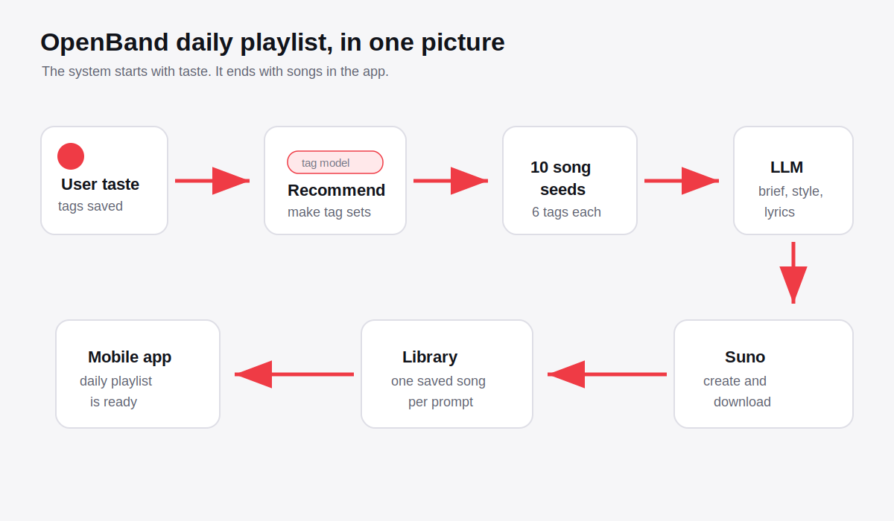
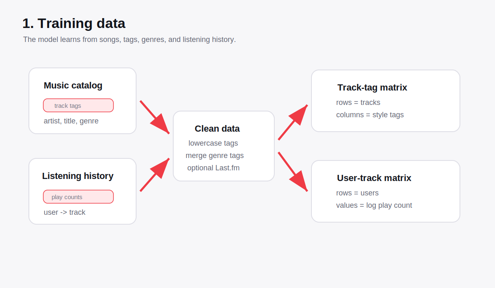
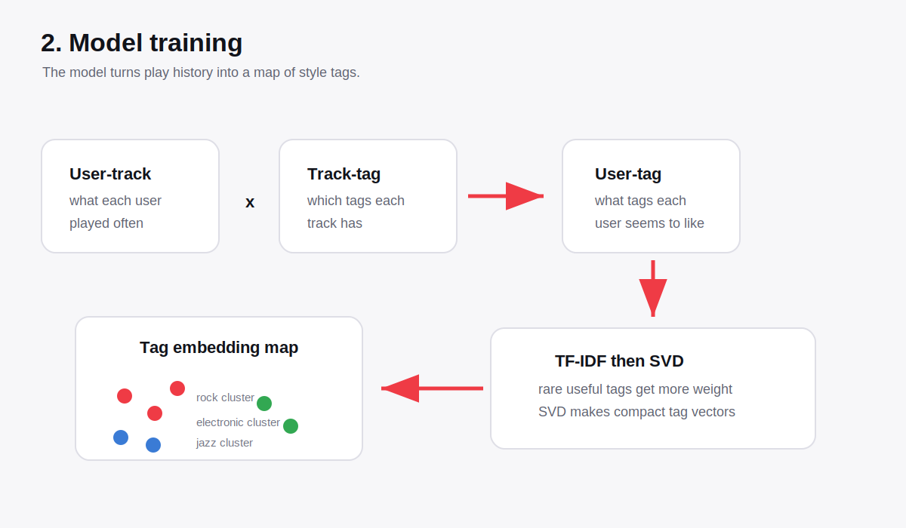
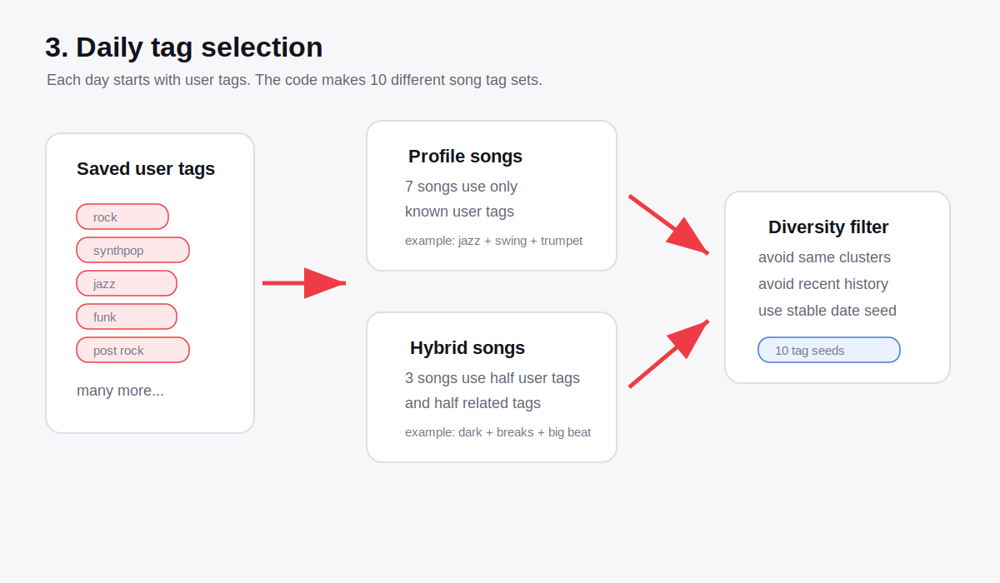
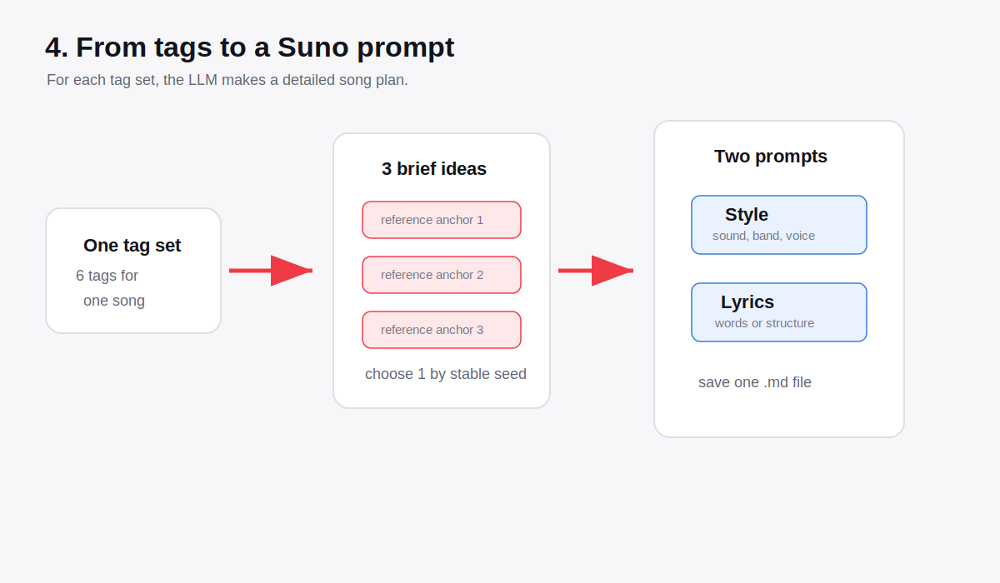
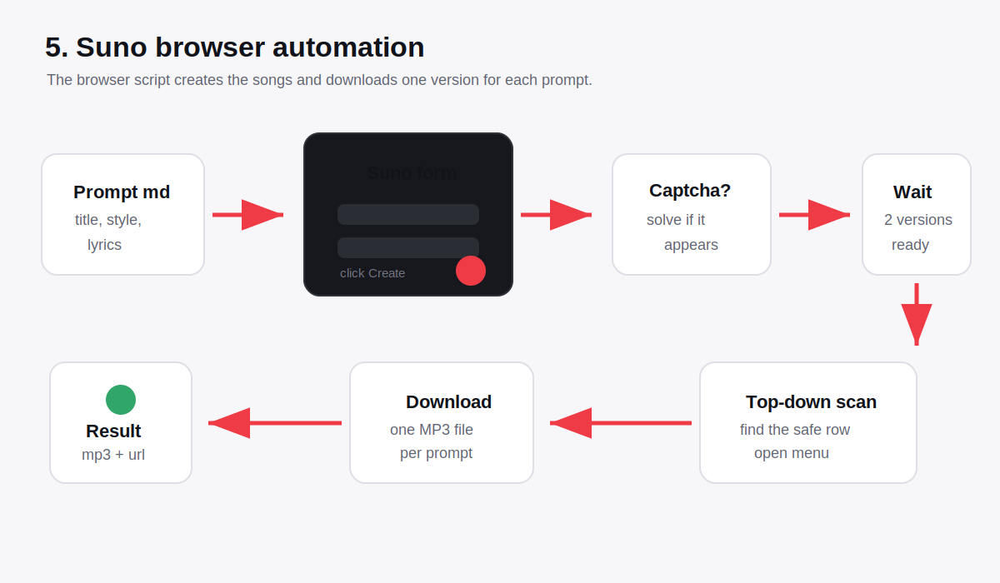
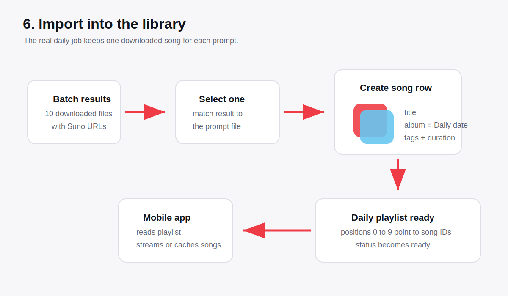
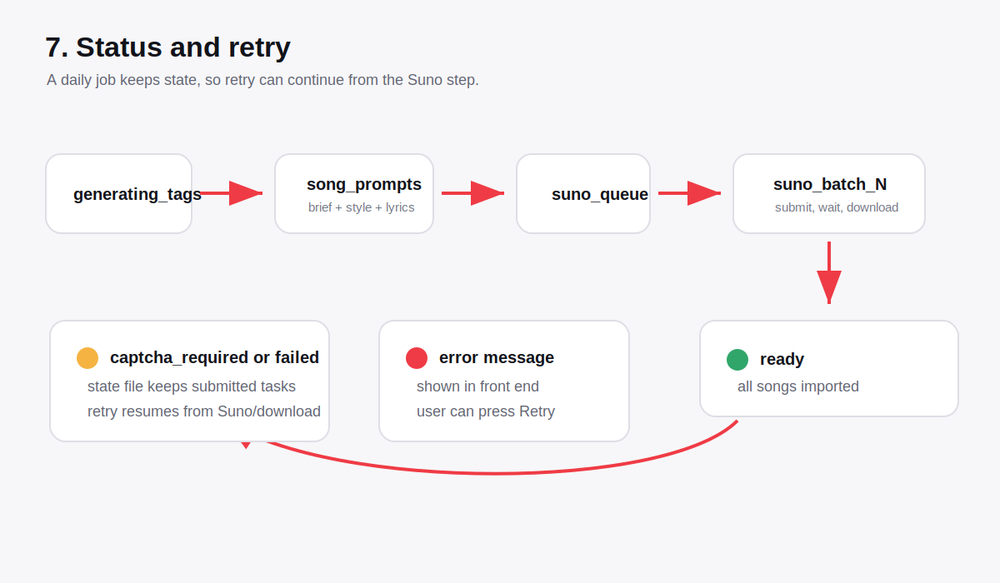

# OpenBand Daily Playlist System

Simple English guide.

This file explains three things:

1. How the recommendation model is trained.
2. How the model is used for the daily playlist.
3. How the daily playlist becomes real songs.



## Short Version

OpenBand does not start by asking the AI to make random songs.

It starts with **music taste tags**.

Then it makes **10 different tag groups** for the day.

Then an LLM turns each tag group into:

- a clear song idea
- a Suno style prompt
- Suno lyrics

Then the browser script sends those prompts to Suno, downloads the songs, and puts one song per prompt into the daily playlist.

## Part 1: How The Recommendation Model Is Trained

The recommendation model is a **tag relationship model**.

It learns questions like:

- If a user likes `nu metal`, what other tags may fit?
- If a user likes `swing` and `trumpet`, what tags are nearby?
- Are `synthpop` and `80s` close?
- Are `rapcore` and `hard rock` close?

The model does not write music.

It only learns how style tags are related.



### Training Inputs

The training code reads two main tables:

| Input | Meaning |
| --- | --- |
| Music catalog | Songs with title, artist, genre, and tags |
| Listening history | Which user played which track, and how often |

It can also merge extra Last.fm tags when that data is available.

The code cleans all tags first:

- lower case
- remove noise
- normalize spelling
- combine catalog tags, genre tags, and optional Last.fm tags

### Training Steps



The model builds two matrices:

| Matrix | Meaning |
| --- | --- |
| User-track matrix | Each user and the tracks they played |
| Track-tag matrix | Each track and the style tags it has |

Then it multiplies them:

```text
user-track matrix x track-tag matrix = user-tag matrix
```

This means:

> If a user plays many tracks with a tag, that tag becomes important for that user.

Then the model applies:

- **TF-IDF**: gives useful rare tags more value
- **SVD**: makes small dense vectors for tags
- **cosine similarity**: checks which tags are close

The final file is saved as:

```text
models/style_model.joblib
```

## Part 2: What The Model Can Do

After training, the model can do three useful things.

### 1. Find Known Tags

It checks which user tags are known by the model.

Example:

```text
user tags:
alternative rock, nu metal, rapcore, jazz, funk
```

If the model knows these tags, it can use them.

If a tag is unknown, it is ignored for model math.

### 2. Expand Tags

The model can find related tags.

Example:

```text
input:
techno, dark, alternative rock

possible nearby tags:
breakbeat, big beat, breaks
```

This is how daily playlists can include fresh but still related ideas.

### 3. Score Tag Groups

The model can compare:

```text
user taste tags <-> candidate song tags
```

It uses:

- embedding similarity
- direct tag overlap

This helps avoid random songs.

## Part 3: How Tags Become A Daily Playlist

Every daily playlist starts from the user's saved music tags.



### Daily Tag Rules

The current daily system makes:

| Item | Value |
| --- | --- |
| Total songs | 10 |
| Tags per song | 6 |
| Profile-only songs | 7 |
| Hybrid songs | 3 |

### Profile-only Songs

These songs use only the user's own saved tags.

Example:

```text
free jazz, jazz, swing, big band, trumpet, male vocalists
```

This keeps the playlist close to the user.

### Hybrid Songs

These songs use:

- half user tags
- half related model tags

Example:

```text
techno, dark, alternative rock, breakbeat, big beat, breaks
```

This adds discovery.

The playlist still feels personal, but it can move a little.

### Diversity Filter

The system does not want 10 songs that all feel the same.

So it checks:

- Is this tag group too close to another song today?
- Is it too close to recent daily playlists?
- Are some tags being used too often?

The result is a daily seed:

```text
Song 1: tag, tag, tag, tag, tag, tag
Song 2: tag, tag, tag, tag, tag, tag
...
Song 10: tag, tag, tag, tag, tag, tag
```

## Part 4: How One Tag Group Becomes One Song Prompt

For each of the 10 tag groups, the LLM first makes **3 song brief candidates**.



Each brief candidate contains:

| Field | Meaning |
| --- | --- |
| `title_seed` | A possible song title |
| `concept` | The main song idea |
| `sound_direction` | Genre, instruments, sound, texture |
| `performance_direction` | Vocal plan or instrumental plan |
| `lyric_angle` | Language, story, image, hook idea |
| `arrangement_hook` | The special musical hook |

The brief now also asks for a **reference anchor**.

Example:

```text
reference anchor:
like Linkin Park - "Papercut" era rap verses and anguished melodic release
```

This does not mean copying.

It means:

> Use this famous style area as a clear direction.

The code then chooses **1 of the 3 candidates** with a stable random seed.

That selected brief is passed into two more LLM prompts:

1. **Style prompt**
2. **Lyrics prompt**

The final markdown file contains:

```text
Title
Style Prompt
Lyrics
Selected Brief
Song Tags
```

## Part 5: How Suno Creates The Songs

The Suno browser script reads the prompt files.



For each prompt, it does this:

1. Open Suno Create.
2. Fill the title.
3. Fill the lyrics box.
4. Fill the style box.
5. Click Create.
6. Solve hCaptcha if needed.
7. Wait for Suno to finish.
8. Find completed rows from top to bottom.
9. Download one safe MP3 result.

Suno usually creates two versions.

The script chooses one version and downloads it.

## Part 6: How The Daily Playlist Is Saved

After downloads finish, the backend imports the results.



For each prompt, the backend keeps one song.

It saves:

- MP3 file
- title
- album name like `Daily 2026-06-23`
- tags
- duration
- Suno URL
- selected brief metadata

Then it writes the daily playlist order:

```text
position 0 -> song id
position 1 -> song id
...
position 9 -> song id
```

When all 10 are imported, the playlist status becomes:

```text
ready
```

## Part 7: Retry And Resume

Daily generation can fail for normal reasons:

- captcha appears
- Suno page changes
- download scan misses a row
- browser timeout
- network problem

The system stores state for every batch.



If retry is used, it should not start from zero.

It can resume from the Suno batch and download stage when prompt files already exist.

That is why the system stores:

- prompt file paths
- batch state file
- submitted task status
- downloaded result JSON
- daily job id
- user id
- playlist id

## Code Map

Important files:

| File | Job |
| --- | --- |
| `backend/src/music_taste_rec/style_model.py` | Train and use the tag model |
| `backend/src/openband/prompt_generation/cli.py` | Build daily tag seeds and LLM prompts |
| `backend/src/openband/prompt_generation/prompts/brief_candidates.prompt.md` | Make 3 song brief candidates |
| `backend/src/openband/prompt_generation/prompts/style.prompt.md` | Make Suno style text |
| `backend/src/openband/prompt_generation/prompts/lyrics.prompt.md` | Make Suno lyrics |
| `backend/src/openband/daily.py` | Run the daily job and import songs |
| `backend/src/openband/suno_browser/playwright/scripts/batch-suno.mjs` | Drive Suno in the browser |

## End-to-End Flow

```text
Raw music data
  -> train tag model
  -> save style_model.joblib
  -> user saves taste tags
  -> daily code builds 10 tag groups
  -> LLM makes 3 briefs for each group
  -> stable seed picks 1 brief
  -> LLM makes style and lyrics
  -> browser sends prompts to Suno
  -> MP3 files download
  -> backend imports one song per prompt
  -> mobile app shows the Daily playlist
```

That is the full path from recommendation training to a daily playlist.
